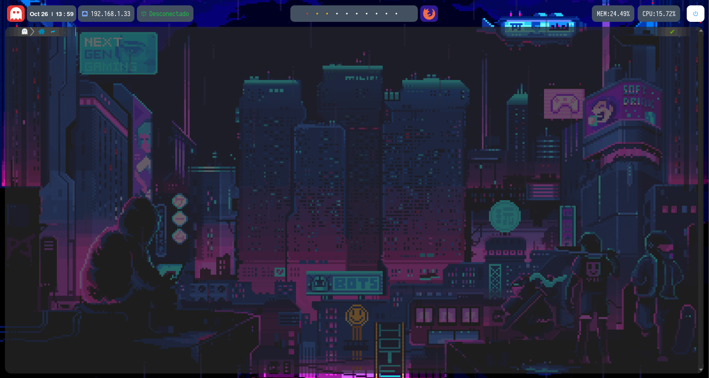

# Denigrante Hax0r GUI
---



---
## Vamos a hacer una guia de como instalar y personalizar nuestro escritorio con bspwm


Esta guia se realiza a 24 de octubre de 2021, es posible que en el momento que estes leyendo esto las dependencias esten cambiando.

Primero instalamos las dependencias:
```bash
$sudo apt-get install libxcb-xinerama0-dev libxcb-icccm4-dev libxcb-randr0-dev libxcb-util0-dev libxcb-ewmh-dev libxcb-keysyms1-dev libxcb-shape0-dev
```

Ahora nos pillamos de primeras los dos repos que vamos a necesitar principalmente de github:

```bash
$git clone https://github.com/baskerville/bspwm.git
$git clone https://github.com/baskerville/sxhkd.git
```

Ahora vamos a compilar e instalar el bspwm:

```bash
$cd bspwm
$make
$sudo make install
$sudo apt install bspwm
```

Ahora lo propio pero con sl sxhkd:
```bash
$cd ../sxhk
$make
$sudo make install
```

También se puede hacer con el apt:
```bash
$sudo apt install bspwm
```

Ahora queda la parte de configuración de estos dos programas, podemos utilizar los ejemplos como plantillas:

```
$cp gitrutabspwm/examples/bspwmrc ~/.config/bspwm/bspwmrc
$cp gitrutasxhkd/examples/sxhkdrc ~/.config/sxhkd/sxhkdrc
```

Podríamos definir que nos habra kitty o alacritty o cualquier emulador de consola desde el archivo sxhkd, que es un daemon de shortcuts.

Bueno yo voy a establecer por aqui un script custom en el archivo en ~/.config/bspwm/scripts/bspwm_resize:
```bash
#!/bin/bash

[ "$#" -eq 3 ] || { echo "Needs exactly three arguments."; exit 1; }

motion="$1"
direction="$2"
size="$3"

if [ "$motion" = 'expand' ]; then
	# These expand the window's given side
	case "$direction" in
		north) bspc node -z top 0 -"$size" ;;
		east) bspc node -z right "$size" 0 ;;
		south) bspc node -z bottom 0 "$size" ;;
		west) bspc node -z left -"$size" 0 ;;
	esac
else
	# These contract the window's given side
	case "$direction" in
		north) bspc node -z top 0 "$size" ;;
		east) bspc node -z right -"$size" 0 ;;
		south) bspc node -z bottom 0 -"$size" ;;
		west) bspc node -z left "$size" 0 ;;
	esac
fi
```

Ahora desde el archivo ~/.config/sxhkd/sxhkdrc, establecemos el shortcut, con el path absoluto a poder ser:

```bash
alt + super + {Left,Down,Up,Right}
	/home/yuki/.config/bspwm/scripts/bspwm_resize {west, south, north, east}
```

Ahora que ya tenemos lo gordo montado toca instalar la polybar y configurarla un poco, aunque antes toca instalar dependencias. Es un programa que nos pinta en pantalla cosas utiles, como la hora, el workspace en el que estemos y muy personalizable:

```bash
$sudo apt install cmake cmake-data pkg-config python3-sphinx libcairo2-dev libxcb1-dev libxcb-util0-dev libxcb-randr0-dev libxcb-composite0-dev python3-xcbgen xcb-proto libxcb-image0-dev libxcb-ewmh-dev libxcb-icccm4-dev libxcb-xkb-dev libxcb-xrm-dev libxcb-cursor-dev libasound2-dev libpulse-dev libjsoncpp-dev libmpdclient-dev libcurl4-openssl-dev libnl-genl-3-dev libuv1-dev
```

Ahora nos movemos a nuestra ruta donde teniamos los anteriores clone:

```bash 
$git clone --recursive https://github.com/polybar/polybar
```

Y bueno realmente lo mismo de antes compilar el paquete e instalarlo:

```bash
$cd polybar
$mkdir build
$cd build
$cmake ..
$make -j$(nproc)
$sudo make install
```

Ahora nos toca instalar algún tipo de compositor para ajustar las transparencias y jugar con atributos graficos:

Pero antes, adivina que. Si, mas dependencias:

```bash
$sudo apt update
$sudo apt install meson libxext-dev libxcb1-dev libxcb-damage0-dev libxcb-xfixes0-dev libxcb-shape0-dev libxcb-render-util0-dev libxcb-render0-dev libxcb-randr0-dev libxcb-composite0-dev libxcb-image0-dev libxcb-present-dev libxcb-xinerama0-dev libpixman-1-dev libdbus-1-dev libconfig-dev libgl1-mesa-dev libpcre2-dev libevdev-dev uthash-dev libev-dev libx11-xcb-dev libxcb-glx0-dev
```

```bash
$git clone https://github.com/ibhagwan/picom.git
$cd picom/
$git submodule update --init --recursive
$meson --buildtype=release . build
$ninja -C build
$sudo ninja -C build install
```

**Ahora ya solo quedan ajustes menores y personalización enhorabuena por haber llegado hasta aqui!!!!**

Instalar rofi, que es como un launcher de apps:

```bash
sudo apt install rofi
```

**Ahora ya podriamos reiniciar y seleccionar bspwm como ui!**

Instalamos feh para cargar fondos de pantall desde el bspwmrc o gifs en caso de usar mi script:

```bash
sudo apt install feh
```

```bash
echo "feh --bg-fill ~/Desktop/fondo.jpg" >> ~/.config/bspwm/bspwmrc
```

Ahora makearemos un poco la polybar, nos vamos a la carpeta de los clones:

```bash
$git clone https://github.com/VaughnValle/blue-sky.git
$cd blue-sky
$mkdir ~/.config/polybar
$cp * -r ~/.config/polybar
$cd ~/.config/polybar
$echo "``pwd`/./launch.sh >> ~/.config/bspwm/bspwmrc
$cd fonts
$sudo cp * /usr/share/local/fonts
$fc-cache -v
```

Recargamos la interfaz con lo que sea que tengamos asignado en el sxhkdrc o reiniciamos y veremos la polybar arriba. Pero queda algo feo, eso es porque no estan bien aplicadas las transparencias, por lo que ahora queda aplicar picom, el compositor que hemos intalado anteriormente. En mi caso Super(Windows)+alt+r.

Nos vamos al archivo picom.conf y hacemos un replace de:
+ 'backend = "glx"' por 'backend = "xrender"'
+ comentamos todo lo que tenga glx

Antes de recargar nada hay un comando util para saber en que ventana estamos, esto nos focuseara la ventana en la que esta el puntero. Agregar a bspwmrc:
```
$bspc config focus_follows_pointer true
```

De paso tambien agregamos:
```
picom --experimental-backends &
bspc config border_width 0
```

Ahora ya podemos empezar con lo divertido. Configurar la polybar. Desde la ruta de ./config/polybar podemos tocar las configuraciones y se compone principalmente de 2 archivos, los .ini y el launch.sh. En los .ini defines una serie de modulos, ubicación y atributos y desde launch.sh finalmente los lanzas.

En los .ini puedes definir modulos customizados con tus propios cripts por ejemplo yo tngo uno que es para saber que ip tengo.

```#!/bin/bash
ip a | grep -w "inet" | grep -v 127 | awk '{print $2}' | tr "/" "\n" | hread -1
```

Defino el modulo apuntando a la ruta absoluta de ese script:

```
[module/mi_ip]
type = custom/script
interval = 2
exec = ~/.config/bin/ip.sh
```

Luego creamos el elemento:
```
[bar/ip]
inherit = bar/main
width = 8%
height = 40
offset-x = 11%
offset-y = 15
bottom =false
font-0 = "Iosevka Nerd Font:size=12;3"
background = ${color.bg} o #ffffff
padding = 1
module-margin-left = 1
module-margin-right = 1
```

Y por ultimo agregamos el elemento al launch:
```bash
polybar ip -c ~/.config/polybar/current.ini
```


##### Creds
+ Aljavier: https://gist.github.com/aljavier/9c06356f4647b56ab3238d66219be6fa
+ S4vitar: https://pastebin.com/EEX1Dsuq